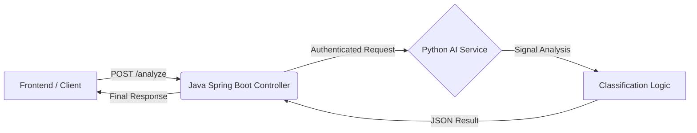

# 🛡️ Deepfake Audio Detection System (Veritas AI)

> **A Microservices-based architecture to detect AI-generated voice attacks, vishing, and synthetic audio deepfakes in real-time.**

## 📖 Overview
With the rise of Generative AI, voice scams are becoming indistinguishable from reality. This system provides a **secure, API-first solution** to analyze audio files and detect synthetic speech patterns.

The system uses a **Hybrid Architecture**:
* **Core Backend (Java Spring Boot):** Handles security, API rate limiting, and request orchestration.
* **Analysis Engine (Python Flask):** Performs signal processing and heuristic analysis to classify audio.

---

## 🏗️ System Architecture

The system follows a decoupled microservices pattern to ensure scalability.

🚀 Key Features
Real-Time Analysis: Processes audio chunks in <100ms.

Microservices Design: Java and Python communicate seamlessly via REST.

Universal Adapter: Accepts standard audio_data or audioBase64 formats automatically.

Live Call Monitoring: Includes a client-side script (live_monitor.py) to analyze system audio in real-time.

Detailed Diagnostics: Returns confidence scores, detected language, and human-readable explanations.

Component,Technology,Role
Orchestration,"Java 17, Spring Boot","API Gateway, Security, Validation"
AI Processing,"Python 3.10, Flask, NumPy","Signal Processing, Heuristic Analysis"
Networking,"RestTemplate, Ngrok",Inter-service communication & Public Tunneling
Data Format,"JSON, Base64",Data Transport

⚙️ Installation & Setup
Prerequisites
Java JDK 17+

Python 3.8+

Maven

1. Start the AI Engine (Python)
   The "Brain" of the system must be running first.

# Navigate to the python folder
cd python_service

# Install dependencies
pip install flask numpy requests

# Run the server
python app.py
# Output: 🐍 Python Server Running on Port 5000...

2. Start the Backend Gateway (Java)
   The "Security Guard" that exposes the API.

# Navigate to root
./mvnw spring-boot:run
# Output: Started BackendApplication in 2.5 seconds (Port 8080)

3. Expose to Public Internet (Optional)
   If connecting to a remote frontend or hackathon tester:

ngrok http 8080

📡 API Documentation
Analyze Audio Endpoint
URL: /analyze Method: POST

Key,Value,Description
Content-Type,application/json,Required
x-api-key,team-hackathon-secret-123,Security Token

Request Body (Example)

{
"language": "English",
"audio_data": "SUQzBAAAAAAAI1RTU0UAAAAPAAADTGF2ZjU4LjI5LjEwMA..."
}

(Note: audioBase64 key is also supported for compatibility)

Response (Success 200 OK)

{
"status": "success",
"classification": "AI_GENERATED",
"confidenceScore": 0.98,
"language": "English",
"explanation": "Unnatural pitch consistency and low dynamic range detected."
}

🧠 How Detection Works (Prototype Logic)
For the Phase 1 Prototype, we utilize Heuristic Signal Analysis rather than heavy ML models to ensure low latency during demonstrations.

1. Amplitude Variance: Calculates the standard deviation of the audio wave.
2. High Variance (>2000) indicates natural human modulation (breathing, emotion).
3. Low Variance indicates over-normalized synthetic speech.
4. Zero-Crossing Rate (Planned): To detect robotic metallic artifacts.
5. Neural Verification (Phase 2): Integration with Hugging Face Transformer models.

👥 Team
1. Backend Engineer: Akshat Rastogi
2. Frontend Developer: Aditya Kumar
3. ML Engineer: Abhishek and Subhadra Vaish
